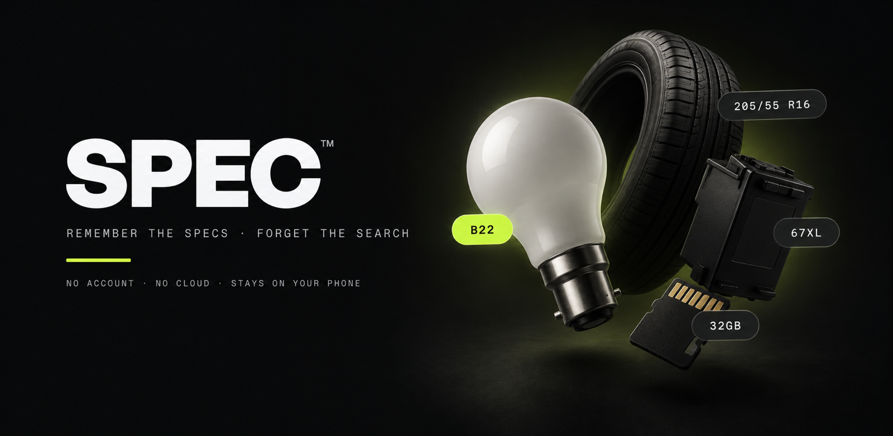
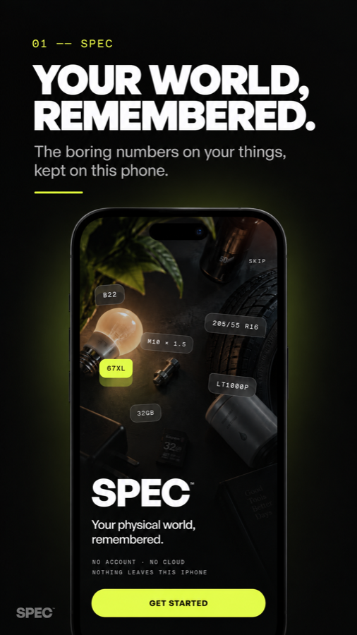
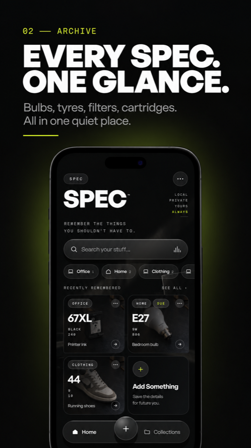
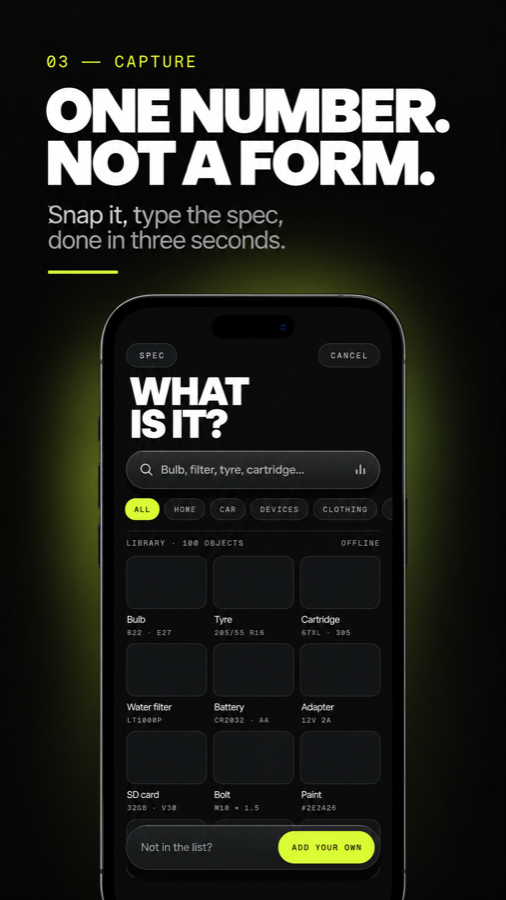
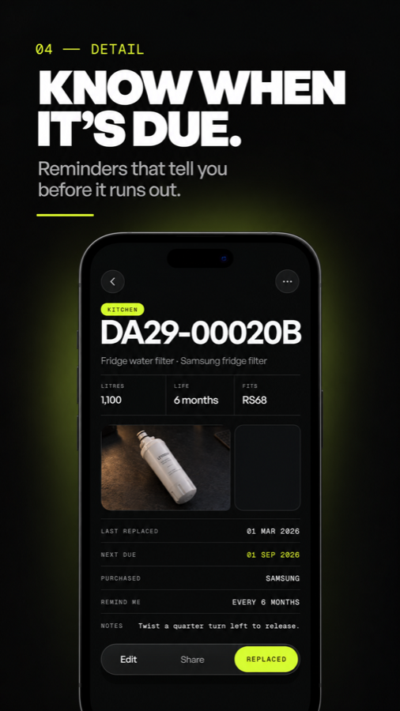
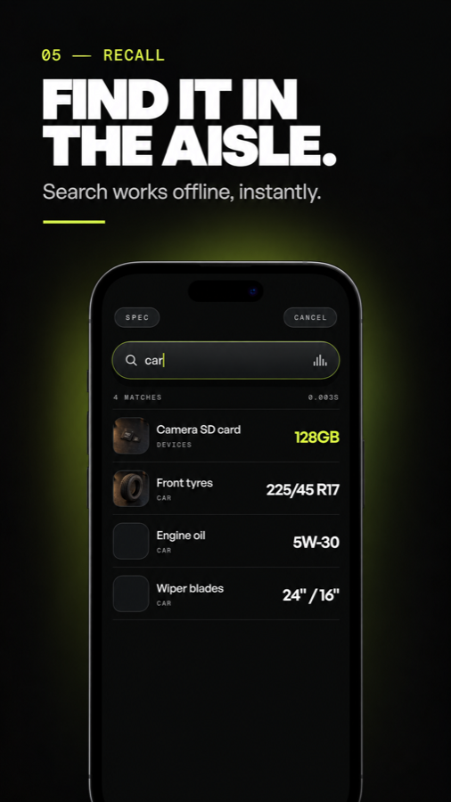
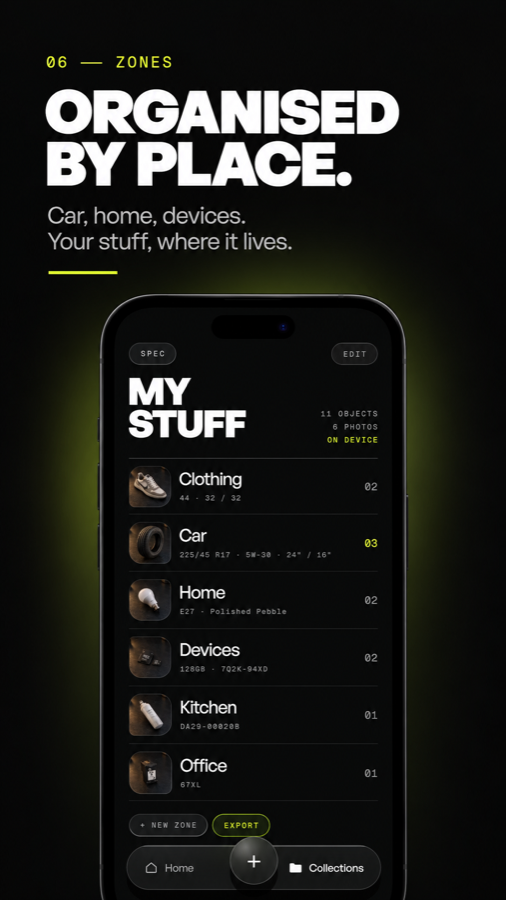

<div align="center">



<br>

**The exact bulb, filter, tyre or ink for everything you own. Always at hand.**

[](https://flutter.dev)
[](#)
[](#testing)
[](#privacy)

</div>

---

## The problem

You are standing in the shop. Which bulb fits the hallway lamp? Was the fridge filter a DA29 or an LT1000? What size were the front tyres?

The answer is a short string of characters you have looked up five times already. SPEC is where you put it the first time.

<br>

<div align="center">



<br>



</div>

<br>

## What it does

| | |
|---|---|
| **Save it once** | Pick from a 100-object library or add your own. Snap the part or its label, type the spec that matters. |
| **Find it fast** | Offline search across everything you own, scored and ranked, with zone filters. |
| **Know when it's due** | Set a replacement interval and get a local notification before it runs out. |
| **Organised by place** | Kitchen, Car, Office, Devices. Zones follow where things actually live. |
| **Yours alone** | No account, no cloud, no analytics, no ads. Export a backup file you keep. |

<br>

## Privacy

SPEC has **no internet permission**. It cannot phone home even if it wanted to.

- Objects, photos, zones and reminders live in the app's private storage
- Reminders are scheduled on the device, never through a push server
- Backups are a zip file you create and control
- Delete everything from Settings, or uninstall

<br>

## Architecture

A feature-first Flutter app, immutable state, no service locators.

```
lib/
├── app/            router, splash gate
├── data/           drift database, repositories, search, backup, photos
├── providers/      Riverpod providers (code-generated)
├── theme/          design tokens
│
├── onboarding/     welcome, how it works, first object
├── home/           header, cards, zone pills, tab bar
├── search/         query, scoring UI, results
├── library/        100-object catalogue picker
├── add/            add flow sheets, manual entry
├── object/         detail, inline edit, photos, actions
├── collections/    zones, rename, delete, export
├── settings/       privacy, backup, wipe
└── services/       photo capture, reminder notifications
```

**Stack**

| Layer | Choice |
|---|---|
| State | [Riverpod](https://riverpod.dev) with code generation |
| Database | [drift](https://drift.simonbinder.eu) over SQLite, typed queries and migrations |
| Routing | [go_router](https://pub.dev/packages/go_router) |
| Reminders | `flutter_local_notifications` with `timezone`, inexact alarms |
| Media | `image_picker`, private on-device photo store with thumbnails |
| Backup | `archive` zip with a versioned manifest and bounded reads |

<br>

## Getting started

```bash
git clone https://github.com/RaoAhmadRaza/SPEC.git
cd SPEC
flutter pub get
dart run build_runner build --delete-conflicting-outputs   # drift + riverpod codegen
flutter run
```

Requires Flutter 3.47 or newer. Android minSdk 24, targetSdk 36.

<br>

## Testing

467 tests cover the data layer, providers, routing and every screen.

```bash
flutter analyze
flutter test
flutter test --coverage
```

Widget tests never use `pumpAndSettle` — the home orb breathes and carets blink forever, so tests pump in fixed rounds instead.

<br>

## Store assets

`tool/store_screenshots_test.dart` is a headless harness that seeds a realistic database, boots the real app and captures every screen at 4K. It is deliberately outside `test/`, so it never runs in the normal suite.

```bash
flutter test tool/store_screenshots_test.dart
# → build/store_screenshots/*.png at 1767 × 3840
```

<br>

## Release build

```bash
flutter build appbundle --release --obfuscate --split-debug-info=build/symbols
```

Signing reads `android/key.properties`, which is gitignored along with the keystore. Keep `build/symbols/` for each version you ship; without it, crash traces stay obfuscated.

<br>

---

<div align="center">

**SPEC™** · Remember the things you shouldn't have to.

</div>
